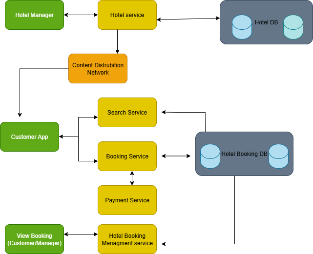

# Requirement Analysis in Software Development.

The purpose of this repo is for project team gathers, analyzes, and defines the requirements of the software product to be developed.

# What is Requirement Analysis?
Requirement Analysis is a critical phase in the Software Development Life Cycle (SDLC) where the needs and expectations of stakeholders are gathered, analyzed, validated, and documented to define what a system should do. It bridges the gap between the problem domain (what the users need) and the solution domain (what the system will provide).

# Why is Requirement Analysis Important?
1. Defines Clear Project Scope
Description: Requirement Analysis helps outline exactly what the system should and should not do.
Why it’s important: This prevents scope creep—the uncontrolled addition of new features during development—and ensures all stakeholders have a shared understanding of the project goals and boundaries.

2. Reduces Costly Errors and Rework
Description: By identifying and validating requirements early, teams can catch misunderstandings or gaps before development begins.
Why it’s important: Fixing issues during coding or testing is significantly more expensive and time-consuming than addressing them during the planning phase.

3. Enables Better Planning and Estimation
Description: Clear, detailed requirements allow for more accurate time, cost, and resource estimates.
Why it’s important: This improves budgeting, scheduling, and staffing decisions, leading to more predictable and efficient project delivery.

# Key Activities in Requirement Analysis.

* Requirement Elicitation
  Collecting information from stakeholders using interviews, surveys, observations, and workshops.

* Requirement Gathering
  Compiling and organizing the collected data into clear sets of user and system requirements.

* Requirement Modeling
  Representing requirements visually or structurally using tools like use case diagrams, flowcharts, or data models.

* Requirement Documentation
  Writing formal documents such as the Software Requirements Specification (SRS), user stories, or use cases.

* Requirement Validation
  Ensuring the requirements are correct, complete, feasible, and agreed upon by all stakeholders.

* Requirement Prioritization
  Identifying which features are essential and must be developed first to allocate resources effectively.

# Types of Requirements.

1. Hotel Management Service
Functionality:
 •	Add/update/delete hotel details and room types
 •	Manage pricing, inventory, and hotel information
 Functional Requirements Examples:
 •	Hotel managers can create, update, and delete room types (e.g., standard, deluxe) 
 •	Hotel managers can set daily prices and adjust available inventory 
 Non-Functional Requirements Examples:
 •	High availability: The hotel manager portal must be accessible at all times 
 •	Low latency for read/write operations via master-slave DB setup and caching 

2. Customer Service (Search + Booking)
Functionality:
 •	Searching for hotels
 •	Creating a booking transaction
 •	Interfacing with payment services
 Functional Requirements Examples:
 •	Users can search hotels by location and date using ElasticSearch 
 •	Users can book a room, triggering availability checks and payment workflows 
 •	Integration with a third party payment gateway (e.g., Stripe, PayPal) 
 Non-Functional Requirements Examples:
 •	Consistency: Prevent double-booking via distributed locks or Serializable isolation 
 •	High performance & low latency: Use Redis cache for availability lookups 
 •	Scalability: Can handle large concurrent requests and high seasonal traffic 

3. View Booking Service
Functionality:
 •	Allow both customers and hotel managers to view current and past bookings
 Functional Requirements Examples:
 •	Users can view current bookings with check-in/check-out details 
 •	Managers can access booking history and details 
 Non-Functional Requirements Examples:
 •	Fast response times: Use Redis for quickly returning recent bookings 
 •	Availability & reliability: System should remain accessible even if archival services are offline 

Summary Table
Subsystem	                    Functional Req.	                              Non-Functional Req.
Hotel Management	            Create/update hotel, room types, prices	      High availability; low latency database operations
Customer Service	            Search hotels, book rooms, process payment	  Consistency (no double-booking); caching for speed
View Booking	                View current & past bookings	                Fast retrieval; service availability

# Use Case Diagrams.
Use Case Diagrams are a type of Unified Modeling Language (UML) diagram used to visually represent the functional requirements of a system. They describe:
•	Actors (users or systems that interact with the application)
•	Use Cases (actions the system performs in response to those actors)
________________________________________
Benefits of Use Case Diagrams
•	Clarify system behavior from a user's perspective
•	Identify system boundaries and functionality
•	Enhance communication among stakeholders, developers, and testers
•	Serve as a planning tool for development and testing
________________________________________
Actors and Use Cases for a Booking System
Actors:
•	Customer – interacts with the system to search, book, and manage bookings
•	Hotel Manager – manages hotel details, rooms, and pricing
•	Payment Gateway – processes payment transactions
Use Cases:
•	Search for hotels
•	View hotel details
•	Make a booking
•	Cancel booking
•	Register/login
•	Manage room inventory
•	Set room pricing
•	View bookings
•	Process payment

